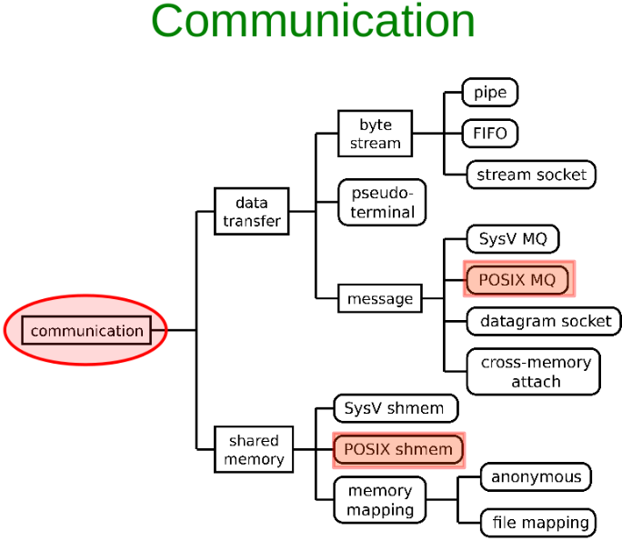
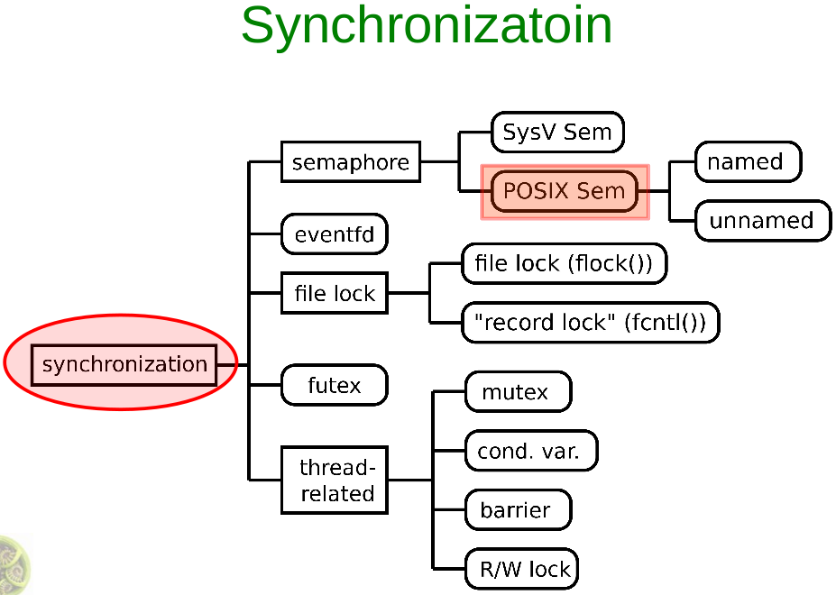
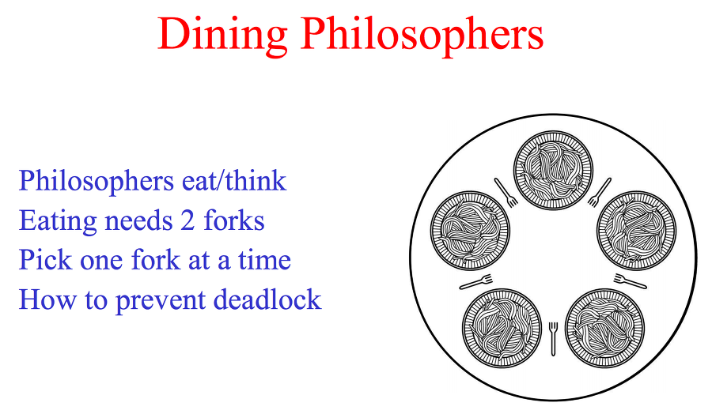

# [Kerrighed IPC](./IPC_kerrighed)

# [GCC Kernel 문법 및 함수 매크로 정리](./IPC_study/gcc)

# IPC(Interprocess Communicataion)

**IPC란?**

프로세스들 간에 데이터 를 주고 받기 위한 매커니즘이다.

크게는 데이터 전송, 메모리 공유 두가지의 방법으로 나뉜다.

그중에서도 Message Queue, Shared Memory, Semaphore의 3가지 방법을 통해서 IPC를 구현한다.

위의 방법들도 SystemV와 POSIX 의 규격에 따라 구현과 방법이 상이하다.

하지만 System V는 AT&T에서 개발한 IPC 표준이다. 이식성이좋은 반면 사용방법이 어려워서 잘 쓰이지 않는다.

물론 잘이쓰이지 않는다는 말은 POSIX IPC 규격이 나왔기 때문이다. SystemV 보다 사용이 간편하고 복잡성이 완화된 규격이다. 

그렇다고해서 어떤 방식을 사용해서 코드를 구현하는게 항상 최적이라는것은 아니다.

적절한 상황과 필요에 의해 사용하면 된다.

## Communication



위의 그림처럼 IPC를 구현하기 위해 다양한 방법으로 통신을 하게 된다.

통신 방법을 선택하는 기준은 환경과 목적에 따라 달라진다.

예를 들어 간단한 예로 파이프를 사용한다 해보자.

터미널에서 파이프는 요긴하게 쓰인다. 단방향 통신으로 한방향으로 redirection을 해주는 기능을한다.

```shell
$ ls | wc -l
```

또다른 예로 다른 노드 간에 IPC를 구현하고자 한다면 소켓을 통해서 통신해야 한다.

이처럼 프로세스들 간의 데이터 통신을 위해 고안된 메커니즘이 IPC이다.

하지만 이러한 통신에서 중요한 이슈가 발생한다.

바로 동기화에 대한 이슈이다. 파이프도 단방향 통신일때는 상관 없지만, 양방향 통신에서 문제가 생길수 있다.

## Synchronization



동기화의 방법에도 여러가지가 있다. 가장 많이 알려진것이 Mutex와 Semaphore 일것이다.

물론 이런 방법들도 각기 다른 상황에서 적절한 방법을 택해야한다.

가장 큰 차이점은 Thread와 Process의 관점일 것이다

Mutex는 **쓰레드**의 관점에서 공유 자원의 데이터를 여러 쓰레드가 접근하는것을 막는것이고,

Semaphore는 **프로세스**의 관점에서 공유된 자원의 데이터를 여러 프로세스가 접근하는것을 막는것이다.

[뮤텍스와 세마포어 차이](https://jwprogramming.tistory.com/13)

### Mutex(Mutual Exclusion)

예를들어 쓰레드를 다룰때에 공유자원의 접근에 대해 무결성을 보장하고자 할때는 뮤텍스를 사용한다.

이때에 Mutex는 상호배제, 즉 임계값을 가진 쓰레드들의 Running time이 서로 겹치지 않게 각가 단독으로 실행되게 함.

뮤텍스 객체를 동시에 두 쓰레드가 사용할수 없음을 의미한다. 뮤텍스도 일종의 객체이기 때문에 프로 세스 범위를 가지며 프로세스가 종료될때 자동으로 clean up된다. 물론 비정상 종료에 있어서도 OS에서 강제로 종료시키기 때문에 데드락 이슈가 발생하지 않는다.

이처럼 mutex는 여러가지 장점이 있지만, 세마포어를 써야하는 상황이 올수도 있다 . 그 기준은 mutex는 동기화 대상이 하나 일때 사용하며, 동기화 대상이 여러개 일때는 세마포어를 사용해야 한다.

### Semaphore

세마 포어는 뮤텍스와 비슷 하다. 그도 그럴것이 임계값(Critical Section)을 갖고 있으며, Mutex와는 다르게 한개 이상의 대상들에 대해서 동기화가 가능하다. 즉, 뮤텍스는 이진 세마포어라고 생각할수도 있는것이다.

세마포어를 이해하는데에는 다음 예제가 가장 적절하다.

#### [식사하는 철학자 - 세마포어](https://simsimjae.tistory.com/72)

저녁식사하는 철학자의 예제를 자세히 살펴보자.

```shell
이진 세마포어(mutex 와 동일)를 활용해서 포크를 손에 쥐는 행위를 하는것을 한 시점에 한 사람만 가능하게끔 해주고, 각 프로세스 별로 세마포어를 또 따로 두어서 최대 2명까지 식사를 하게끔 해주어야 한다.
```



**식사하는 철학자 교착상태 발생 조건**

```shell
상호배제(Mutual exclusion) : 프로세스들이 필요로 하는 자원에 대해 배타적인 통제권을 요구한다.
점유대기(Hold and wait) : 프로세스가 할당된 자원을 가진 상태에서 다른 자원을 기다린다.
비선점(No preemption) : 프로세스가 어떤 자원의 사용을 끝낼 때까지 그 자원을 뺏을 수 없다.
순환대기(Circular wait) : 각 프로세스는 순환적으로 다음 프로세스가 요구하는 자원을 가지고 있다.
```

프로 세스들 간의 교착상황을 방지하기 위해 세마포어를 사용하여 동기화를 한다.


## System V IPC 예제

### 공유메모리 + 세마포어

### shmget

```c
// 공유 메모리 공간 할당(세그먼트) 및 식별자 리턴
#include <sys/ipc.h>
#include <sys/shm.h>

int shmget(key_t key, size_t size, int shmflg);

/* 성공하면 식별자 리턴
RETURN VALUE
       On success, a valid shared memory identifier is returned.  On errir, -1 is returned,
       and errno is set to indicate the error.
*/
```

### shmat

```c
// 생성된 공유메모리의 주소 리턴
#include <sys/types.h>
#include <sys/shm.h>

void *shmat(int shmid, const void *shmaddr, int shmflg);

int shmdt(const void *shmaddr);


/* 성공 하면 공유메모리의 주소를 리턴
RETURN VALUE
       On success shmat() returns the address of the attached  shared  memory  segment;  on
       error (void *) -1 is returned, and errno is set to indicate the cause of the error.

       On  success shmdt() returns 0; on error -1 is returned, and errno is set to indicate
       the cause of the error.
*/
```

### semget

```c
// 세마포어를 만들고 식별자 정의
#include <sys/types.h>
#include <sys/ipc.h>
#include <sys/sem.h>
int semget(key_t key, int nsems, int semflg)
    
/* 성공시에 세마포어 식별자 리턴
RETURN VALUE
       If  successful, the return value will be the semaphore set identifier (a nonnegative
       integer), otherwise -1 is returned, with errno indicating the error.
 */
```

### semop

```c
//세마 포어 제어 
#include <sys/types.h>
#include <sys/ipc.h>
#include <sys/sem.h>
// 임계값을 이용해 세마포어를 닫거나 여는 제어를 해줌.
int semop(int semid, struct sembuf *sops, unsigned nsops);


/*
RETURN VALUE
       If successful semop() and semtimedop() return 0; otherwise they return -1 with errno
       indicating the error.
*/


// 세마포어 오퍼레이션은 다음 구조체를 사용하여 세마포어를 동작시킨다.
struct sembuf
{
  unsigned short int sem_num;	/* semaphore number 세마포어 구별자 */
  short int sem_op;		/* semaphore operation */
    //if sem_op > 0 => 값만큼 세마포어 값에 더함
    //if sem_op = 0 => 현재값이 0인지 확인, 만약 0이 아니라면 0이 될때까지 블락
	//if sem_op < 0 => 값만큼 세마포어 값 감소, 
  short int sem_flg;		/* operation flag */
};


struct semid_ds
{
  struct ipc_perm sem_perm;		/* operation permission struct */
  __time_t sem_otime;			/* last semop() time */
  __syscall_ulong_t __unused1;
  __time_t sem_ctime;			/* last time changed by semctl() */
  __syscall_ulong_t __unused2;
  __syscall_ulong_t sem_nsems;		/* number of semaphores in set */
  __syscall_ulong_t __unused3;
  __syscall_ulong_t __unused4;
};
```


```shell
Total Count is 10000
Now Fork
Start Parent Process
First Process Into Sem with => 425984
SHM_WRITE: PARENT: Now writing
Sleep 10 Sec
Start Child Process
Second Process
SHM_WRITE: PARENT: Writing Done
SHM_WRITE: CHILD: Now writing
Sleep 10 Sec
SHM_WRITE: CHILD: Writing Done
```


├── sem_handler.h
├── semarray_io_linker.c
├── semarray_io_linker.h
├── semundolst_io_linker.c
├── semundolst_io_linker.h
├── shm.c
├── shm_handler.c
├── shm_handler.h
├── shm_memory_linker.c
├── shm_memory_linker.h
├── shmid_io_linker.c
├── shmid_io_linker.h
├── util.c
└── util.h
```

