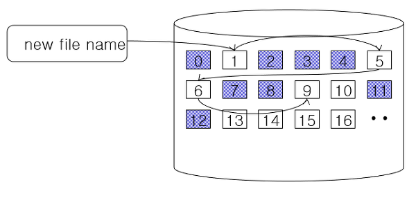
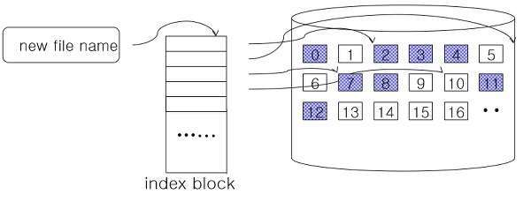
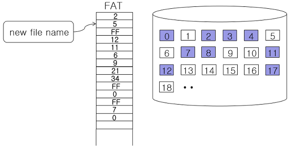

# 파일시스템과 가상파일시스템

## 개요

 파일시스템은 사용자에게 이름이라는 속성으로 접근되는 추상적인 객체인 '파일' 개념을 제공함으로써 영속적인 객체의 저장을 지원하는 소프트웨어이다.

 파일시스템이 하드 디스크에 저장하는 정보는 크게 메타 데이터와 사용자 데이터로 나뉜다. 메타 데이터는 파일의 속성 정보나 데이터 블록 인덱스 정보 등이 해당되며, 사용자가 실제 기록하려 했던 내용이 사용자 데이터에 해당된다.


### 디스크 블록 관리 기법

 파일시스템은 디스크를 논리적인 디스크 블록들의 집합으로 본다. 디스크 블록의 크기가 클수록 한 번의 Disk IO로 더 많은 데이터를 메모리로 읽어 들일 수 있기 때문에, 최근에 개발된 파일시스템의 경우 디스크 블록의 크기를 더 크게 설정하는 경향이 있다.

 디스크 블록의 크기와 '속도' 측면에서의 성능은 비례하지만, '공간 효율성'면에서의 성능은 반비례한다. 평균적으로 데이터 블록 중 마지막 블록의 절반은 낭비된다.


#### 연속(sequential)  할당

	이어진 블록들을 연속적으로 할당하는 방법이다.


#### 불연속(non-sequential)  할당

	서로이어지지 않은 블록들에 대해 불규칙적으로 할당하는 방식이다.


##### - 블록체인 기법



 각 블록에 포인터를 두어 다음 블록의 위치를 기록하는 방식이다. 특정 파일에 속한 첫 번째 디스크 블록에 가면 포인터를 이용해 다음 블록을 찾아 갈 수 있다. 파일의 끝을 읽기 위해 앞 부분의 블록을 읽어야 하기 때문에, 중간의 블록이 유실되면 나머지 데이터 까지 잃게 되는 단점이 존재한다.


##### - 인덱스 블록 기법



 블록들에 대한 위치 정보들을 기록한 인덱스를 따로 사용하는 방식이다. 파일의 끝 부분을 접근하기 위해 데이터를 일일이 읽어야 한다는 단점은 없지만, 인덱스 블록이 유실 될 경우 파일의 전체 데이터가 소실되는 문제가 있다. 이 외에도, 인덱스 블록을 위한 별도 공간이 필요하고, 파일이 커져 인덱스 블록이 가득 찰 경우 이를 해결하기 위한 방법이 필요하다.


 리눅스에서 주로 사용되는 파일시스템인 ext2, ext3가 인덱스 블록 기법과 유사한 기법을 사용하며, 이것이 inode 이다.


##### - FAT 기법




 FAT 이라는 자료 구조에 기록하는 방법. FF는 파일의 끝을 의미하며 0은 free상태를 나타낸다. 파일의 중간 데이터를 읽기 위해 처음 블록부터 읽을 필요가 없다.

 FAT 구조의 유실은 파일시스템 내의 모든 파일이 소실된다는 문제가 있다.


 두 가지 방법 중에서 연속 할당이 불연속 할당에 비해 파일을 읽는 속도가 빠르다. 하지만 파일의 크기가 변하면 문제가 될 수 있다. 따라서 파일시스템을 설계할 때 연속 할당 만은 사용하는 경우는 없다.


## inode 구조

`fs/ext2/ext2.h`

```code
struct ext2_inode {
	__le16	i_mode;		/* File mode */
	__le16	i_uid;		/* Low 16 bits of Owner Uid */
	__le32	i_size;		/* Size in bytes */
	__le32	i_atime;	/* Access time */
	__le32	i_ctime;	/* Creation time */
	__le32	i_mtime;	/* Modification time */
	__le32	i_dtime;	/* Deletion Time */
	__le16	i_gid;		/* Low 16 bits of Group Id */
	__le16	i_links_count;	/* Links count */
	__le32	i_blocks;	/* Blocks count */
	__le32	i_flags;	/* File flags */
...
```


 i_blocks 필드는 이 파일이 몇 개의 데이터 블록을 가지고 있는지 나타내며, i_mode 는 이 inode가 관리하는 파일의 속성 및 접근 제어 정보를 유지한다. i_links_count는 이 inode를 가리키고 있는 파일 수(또는 링크 수)를 의미하며, i_uid와 i_gid는 파일을 생성한 소유자의 user ID와 group ID를 의미한다.

 i_atime, i_ctime, i_mtime은 각각 이 파일의 접근시간, 생성시간, 수정시간을 의미한다.


`i_mode 구조`

| type (4bit) | u      | g      | s      | r    | w    | x    | r    | w    | x    | r    | w    | x    |
| ----------- | ------ | ------ | ------ | ---- | ---- | ---- | ---- | ---- | ---- | ---- | ---- | ---- |
| File type   | setuid | setgid | sticky | u    | u    | u    | g    | g    | g    | o    | o    | o    |


 i_mode는 16비트로 구성되며, 이 중에서 상위 4개의 비트는 파일의 유형을 의미한다. 파일의 유형으로는 정규 파일(S_IFREG), 디렉터리(S_IFDIR), 문자 장치 파일(S_IFCHR), 블록 장치 파일(S_IFBLK), 링크 파일(S_IFLNK), 파이프(S_IFFIFO), 그리고 소켓(S_IFSOCK)등이 있다.

 다음으로 위치한 3개의 비트는 특별한 목적으로 사용된다. u비트는 setuid 비트로 파일이 수행될 때 수행시킨 태스크의 소유자 권한이 아닌, 파일을 생성한 사용자의 권한으로 동작할 수 있도록 한다. g비트는 setgid 비트로 setuid 비트와 유사하게 사용된다. s는 sticky 비트로 태스크가 메모리에서 쫓겨날 때, swap 공간에 유지되도록 할 때, 또는 디렉터리에 대한 접근 제어에 사용된다.

 마지막 9개의 비트는 파일의 접근제어 (읽기/쓰기/실행)을 나타내며 각각 사용자(user), 그룹(group), 다른사용자(other)를 나타낸다.